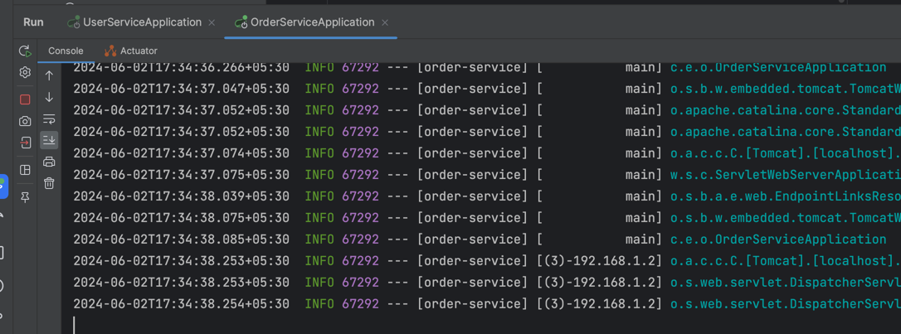
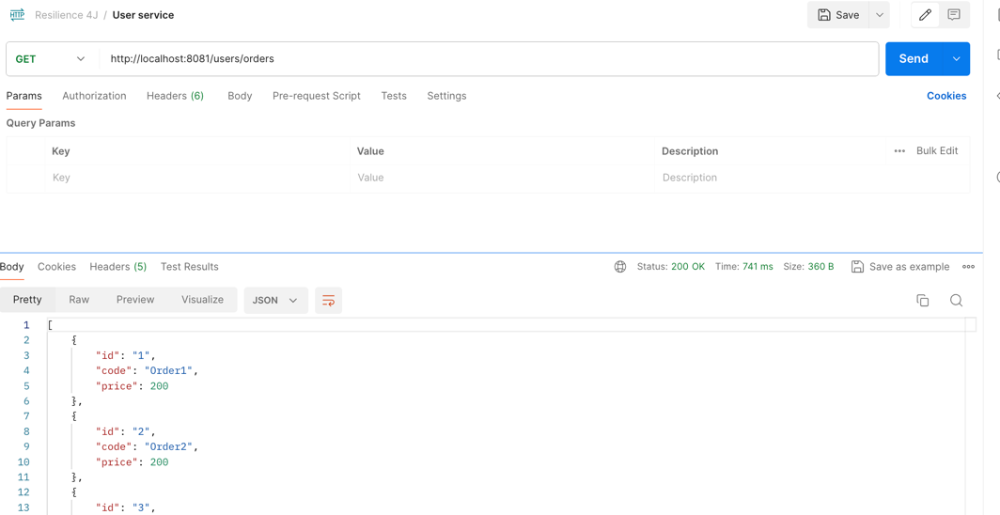
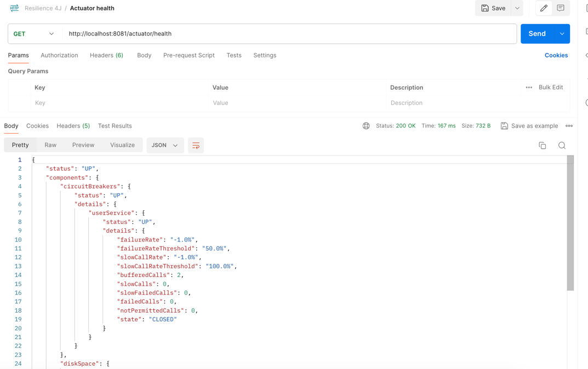
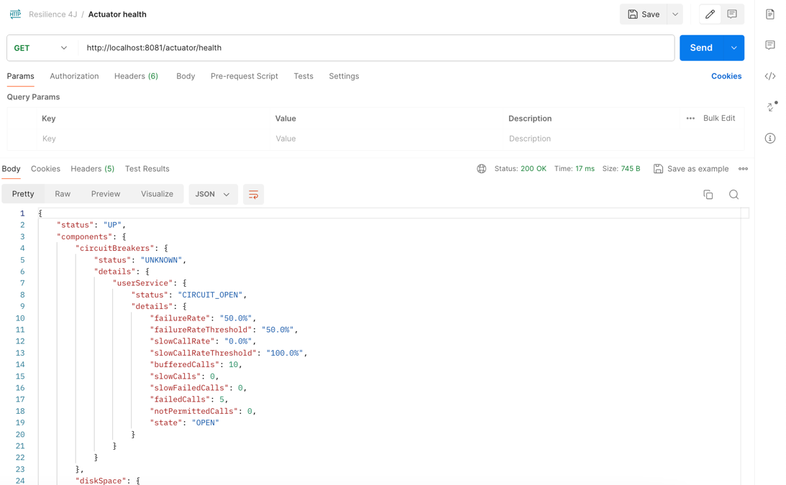
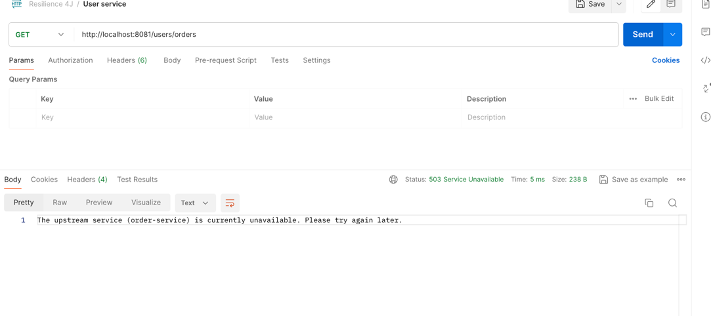
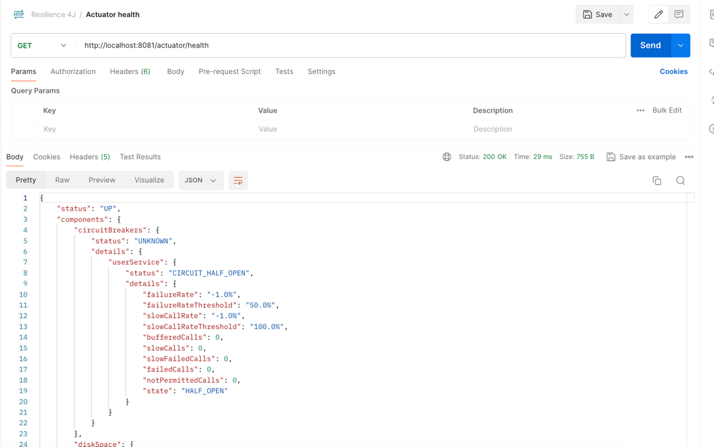

# Resilience4J Concepts

## Circuit Breaker Pattern
- Circuit breaker pattern is used to **enhance the stability and resilience** of applications, especially those that 
depend on remote services.
- It acts like an electrical circuit breaker: it monitors the interactions between services and, **upon 
detecting a high rate of failures, it "trips" the breaker**, preventing further attempts to execute the 
action that is likely to fail. 
- This helps to prevent the system from being overwhelmed with requests that are bound to fail, allowing it to recover and respond more gracefully to failures.

### Cascade failure in microservices
In a microservices architecture, services often depend on other services to fulfill requests. If one service fails or 
becomes unresponsive, it can cause a ripple effect:
- **Service Overloa for failing service**: A failing service may become overloaded with retry attempts from dependent services.
- **Resource Exhaustion for dependent service**: Dependent services may consume excessive resources (e.g., threads, memory) waiting for responses from the failing service, leading to resource exhaustion.
- **System-wide Impact**: The failure can propagate, causing other services to fail or degrade in performance, leading to a cascade failure throughout the system.

### Circuit Breaker States

**Closed State:**
- The circuit breaker starts in this state and allows requests to pass through to the service.
- If the requests succeed, the breaker remains closed.
- If a certain number of requests fail consecutively, the breaker transitions to the open state.

**Open State:**
- In this state, requests are immediately failed without attempting to call the service.
- This helps prevent overloading a failing service and gives it time to recover.
- After a predefined period (timeout), the breaker transitions to the half-open state to test if the service has recovered.

**Half-Open State:**
- In this state, a limited number of requests are allowed to pass through to the service.
- If these requests succeed, the breaker transitions back to the closed state. If any of these requests fail, the breaker reverts to the open state.

### Benefits
- **Improved Stability and Resilience**: Prevents cascading failures in complex systems by stopping repeated attempts to access a failing service.
- **Fast Failure**: Reduces the time waiting for responses from failing services by quickly rejecting requests when the circuit is open.
- **Graceful Degradation**: Allows the system to degrade gracefully rather than crashing under heavy load or when dependent services fail.

### Example
- Imagine an application that relies on an external payment gateway service. If the payment gateway becomes slow or 
unresponsive, the application could suffer from long waits or timeouts. 
- By implementing a circuit breaker, the application can quickly detect the issue and stop trying to send payment 
requests to the gateway, avoiding the accumulation of failed transactions and allowing the application to continue 
functioning, perhaps by serving cached data or displaying a maintenance message.

## About Resilience4J
- Resilience4j is a lightweight **fault tolerance library** designed for
  functional programming.
- It provides higher-order functions (decorators) to enhance any functional interface,
  lambda expression or method reference with a **Circuit Breaker, Rate Limiter, Retry or Bulkhead**

### Working of circuit breaker with Resilience4J
- The CircuitBreaker uses a **sliding window** to store and aggregate the outcome of calls. The count-based sliding window 
aggregrates the outcome of the last N calls. 
- The state of the CircuitBreaker changes from CLOSED to OPEN when the **failure rate is equal or greater than threshold**.
- By default **all exceptions count as a failure**.
- The failure rate can only be calculated, if a **minimum number of calls** were recorded. For example, if the minimum number 
of required calls is 10, then at least 10 calls must be recorded, before the failure rate can be calculated. 
If only 9 calls have been evaluated the CircuitBreaker will not trip open even if all 9 calls have failed.
- The CircuitBreaker rejects calls with a _**CallNotPermittedException**_ when it is OPEN. 
- After a wait time duration has elapsed, the CircuitBreaker state changes from OPEN to **HALF_OPEN** and permits a 
configurable number of calls to see if the backend is still unavailable or has become available again. 
- Further calls are rejected with a CallNotPermittedException, until all permitted calls have completed.
- If the failure rate is then equal or greater than the configured threshold, the state changes back to OPEN. 
If the failure rate and slow call rate is below the threshold, the state changes back to CLOSED.

## Demo

In our project we have created two services:
- order-service (port 8080): Provides list of orders in api response
- user-service (port: 8081): Calls order-service to fetch orders

Circuit breaker is implemented at user-service to introduce fault tolerance.

```java
    @GetMapping("/orders")
    @CircuitBreaker(name = USER_SERVICE, fallbackMethod = "circuitBreakerFallback")
    public ResponseEntity<Object> getOrders() {
```

We have to provide a service name and fallback method for the CircuitBraker annotation.
The fallback method is called when the breaker is in OPEN state.

```properties
# Resilience4J circuit breaker configs
resilience4j.circuitbreaker.instances.userService.register-health-indicator=true
resilience4j.circuitbreaker.instances.userService.event-consumer-buffer-size=10
resilience4j.circuitbreaker.instances.userService.failure-rate-threshold=50
resilience4j.circuitbreaker.instances.userService.minimum-number-of-calls=5

resilience4j.circuitbreaker.instances.userService.automatic-transition-from-open-to-half-open-enabled=true
resilience4j.circuitbreaker.instances.userService.wait-duration-in-open-state=5s
resilience4j.circuitbreaker.instances.userService.permitted-number-of-calls-in-half-open-state=3
resilience4j.circuitbreaker.instances.userService.sliding-window-size=10
resilience4j.circuitbreaker.instances.userService.sliding-window-type=count_based
```

Start both the services:


Hit user-service api. This works fine as of now. The health api shows it is in CLOSED state.




Now stop the order-service. Once we make 5 failed calls, the breaker will 
transition to OPEN state. During open state, it will give 503 response.





After 5 seconds it transitions to HALF_OPEN automatically



In HALF_OPEN state, we allow 3 api calls. If they fail again, 
it moves to OPEN state. If they pass, it will move to CLOSED state.
